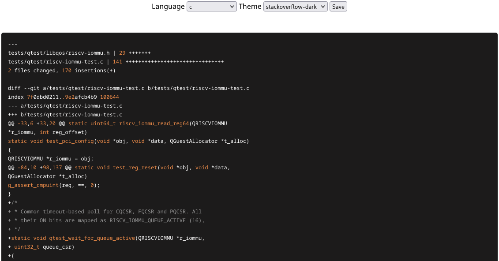

# View as code 📬

View as code is a Mozilla Thunderbird extension that allows opening emails in a separate tab and to format them as code.
This especially useful when reviewing code received from a mailing list.

# How to install

View as code can be packaged and installed from sources.
To do so, run `package.py` and install the output `.xpi` file in Thunderbird.

# Disclaimer

This extension has been developed to fit particular needs and probably doesn't cover every use case.